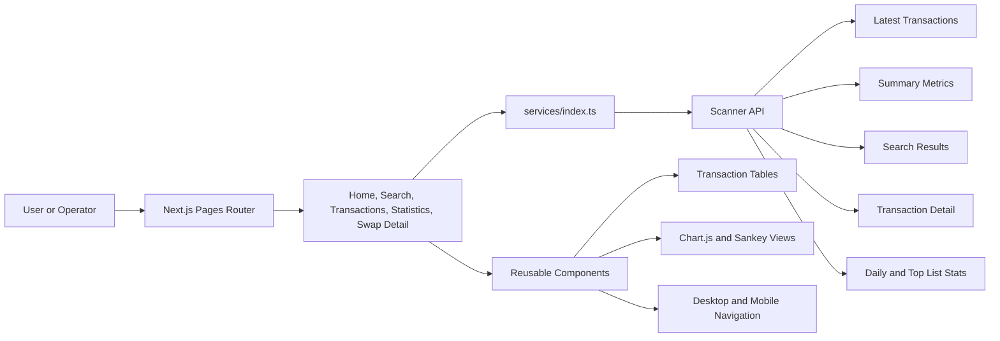
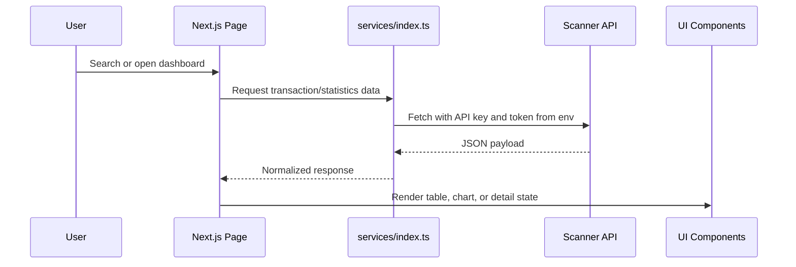

# Explorer

<div align="center">

**A blockchain swap explorer for transaction search, analytics, route inspection, and operational visibility.**


</div>

## Overview

Explorer is the analytics and transparency layer for a swap platform. Where Dexifier focuses on initiating swaps, Explorer focuses on making swap activity searchable, understandable, and measurable.

The application provides transaction search, recent activity, wallet-based lookup, status filtering, swap detail pages, summary statistics, top lists, daily charts, and Sankey-style flow visualizations.

## Why This Project Matters

Crypto transaction experiences often fail after submission: users do not know where a transaction went, operators cannot quickly inspect route-level performance, and dashboards do not explain swap flow across chains. Explorer solves this with a product interface that connects transaction APIs to clear search, tables, charts, and detail pages.

For software engineering review, this project demonstrates:

- Data-heavy frontend architecture.
- API-driven analytics and search.
- Transaction detail modeling.
- Responsive navigation and table UX.
- Chart and Sankey visualization for product telemetry.

## Application Architecture



## Main Features

| Feature | Description |
| --- | --- |
| Home dashboard | Summarizes platform activity and recent swaps. |
| Global search | Searches transaction IDs, wallet addresses, or route-related identifiers. |
| Transaction table | Lists transactions with pagination and status filters. |
| Wallet activity | Fetches swaps associated with a wallet address. |
| Swap detail page | Shows route steps, transaction URLs, tokens, chain metadata, and status. |
| Statistics page | Displays daily summaries, top lists, bar charts, and Sankey flow visualizations. |
| Responsive shell | Desktop and mobile navigation components with shared layout primitives. |

## API Surface

`services/index.ts` centralizes the scanner API calls:

| Function | Purpose |
| --- | --- |
| `getLastSwaps()` | Latest transaction list. |
| `getSummary()` | Platform summary metrics. |
| `getSearchResult(query)` | Search across scanner transaction data. |
| `getWalletSwaps(address, page)` | Wallet-specific transaction history. |
| `getTxDetails(requestId)` | Detailed swap route and status data. |
| `getDailySummary(options)` | Time-series statistics by day/source/destination. |
| `getTopListSummary(days)` | Top chains, tokens, or routes over a selected period. |
| `getBlockchains()` | Chain metadata for filters and UI display. |
| `getTransactions(page, status)` | Paginated transaction table data. |

## Repository Structure

```text
Explorer/
  pages/
    index.tsx                  # Home dashboard
    search.tsx                 # Search result page
    transactions.tsx           # Transaction list and filters
    statistics.tsx             # Analytics and charts
    swap/[id]/index.tsx        # Swap detail view
  components/
    common/                    # Layout, navbar, footer, table, buttons, search box
    home/                      # Summary and home chart components
    transactions/              # Transaction result table, pagination, loading states
    detail/                    # Swap detail summary and route step components
    statistics/                # Bar charts, Sankey chart, top lists
    icons/                     # Local SVG icon components
  services/
    index.ts                   # API client functions
  types/
    transactions.ts            # Transaction and result models
    summary.ts                 # Summary/statistics models
```

## Data Flow



## Technology Stack

- **Framework:** Next.js 13 Pages Router, React 18, TypeScript.
- **Charts:** Chart.js, `chartjs-chart-sankey`, VisX curve/gradient/xychart.
- **Data fetching:** Native `fetch`, SWR dependency available for client-side cache patterns.
- **Styling:** Tailwind CSS, Sass, responsive custom components.
- **UX utilities:** React Toastify, React Modal, Next.js progress bar.
- **Quality tooling:** ESLint, Prettier, Husky, lint-staged, strict TypeScript-oriented lint setup.

## Environment

Create `.env.local`:

```bash
NEXT_PUBLIC_API_URL=https://your-scanner-api.example.com
NEXT_PUBLIC_API_KEY=your_public_api_key
NEXT_PUBLIC_SECRET_KEY=your_public_or_proxy_token
```

For a production deployment, avoid exposing privileged scanner credentials directly to the browser. Prefer a backend-for-frontend or edge proxy for any sensitive token mediation.

## Run Locally

```bash
npm install
npm run dev
```

Open:

```text
http://localhost:3000
```

Production build:

```bash
npm run build
npm run start
```

## Scaling Plan

- Add typed API client validation with runtime schemas.
- Add skeleton loading states and empty-state explanations for every dashboard card.
- Move sensitive scanner access behind a server-side route or API proxy.
- Add E2E tests for search, transaction detail, status filter, and statistics flows.
- Add alert-style operator views for failed routes, slow settlement, and route degradation.
- Add exportable CSV/JSON reports for business or support teams.

## Skills Demonstrated

- Analytics frontend architecture.
- Transaction search and detail UX.
- Chart and Sankey visualization.
- API integration and data normalization.
- Responsive product shell design.
- Operational dashboard thinking for Web3 systems.
